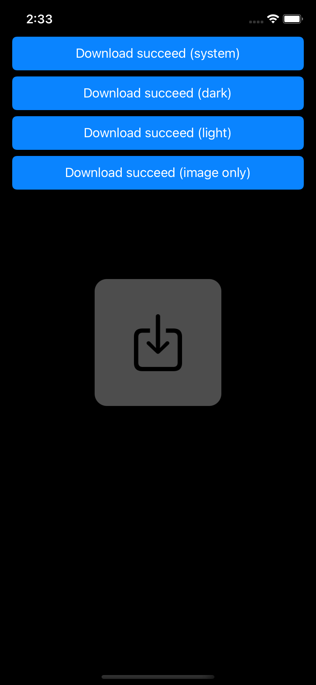
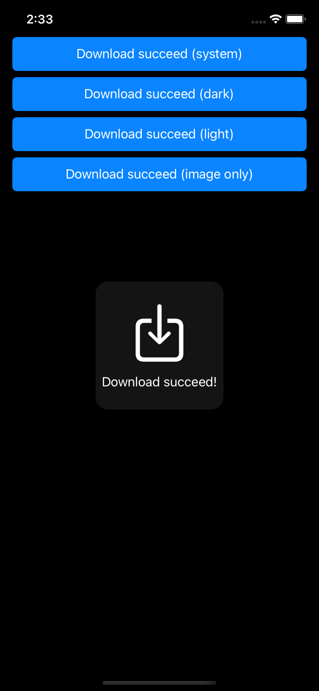
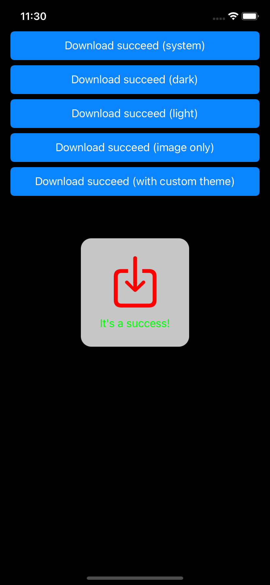

# KVIndicatorView

[](https://github.com/Kelvas09/KVIndicatorView.iOS/actions/workflows/publish.yaml)

## Goal

In many cases, an alert to display information is too restrictive, whereas displaying an indicator for a few seconds is more than enough.

## Screenshots

|Image only|Light mode|Dark mode|Custom theme|
|---|---|---|---|
|||||

## Dependencies

UIKit is the only dependency.

## How install it?

Nowaday we only support `Swift Package Manager`. You can use build-in UI tool for XCode with this search words: `Kelvas09/KVIndicatorView.iOS` or you can add it directyl with this following command :

```swift
.package(url: "https://github.com/Kelvas09/KVIndicatorView.iOS.git", from: "1.0.0")
```

## How use it?

### Getting started

It is very simple to display an indicator. First, you have to create a `KVIndicator` object in which you will fill in all the information related to the display: text (optional), icon, display time and theme (default system):

```swift
let icon = UIImage(systemName: "square.and.arrow.down")!.withRenderingMode(.alwaysTemplate)
let indicator = KVIndicator(icon: icon, text: "Download succeed!", interval: 5, theme: .system)
```

Now all you have to do is ask for the indicator to be displayed:

```swift
KVIndicatorViewController.display(on: self, with: indicator)
```

In this case `self` represents the current viewController. It can be any viewController.

### Custom theme

It's really easy to customize the current view with the theme delegate `KVIndicatorViewThemeDelegate`. You can create your own and use it when you display an indicator.

A small example here:

```swift
final class CustomThemeDelegate: KVIndicatorViewThemeDelegate {

    func titleColor() -> UIColor {
        return .green
    }

    func iconTintColor() -> UIColor {
        return .red
    }

    func blurEffect() -> UIBlurEffect {
        return UIBlurEffect(style: .extraLight)
    }

}
```

Or you can use default theme integration with the class `KVIndicatorViewDefaultThemeDelegate`.

### Technical documentation

You can have more information when the technical [documentation](https://kelvas09.github.io/KVIndicatorView.iOS/documentation/kvindicatorview/).

## Samples

You can access to sample project on folder `Sample`